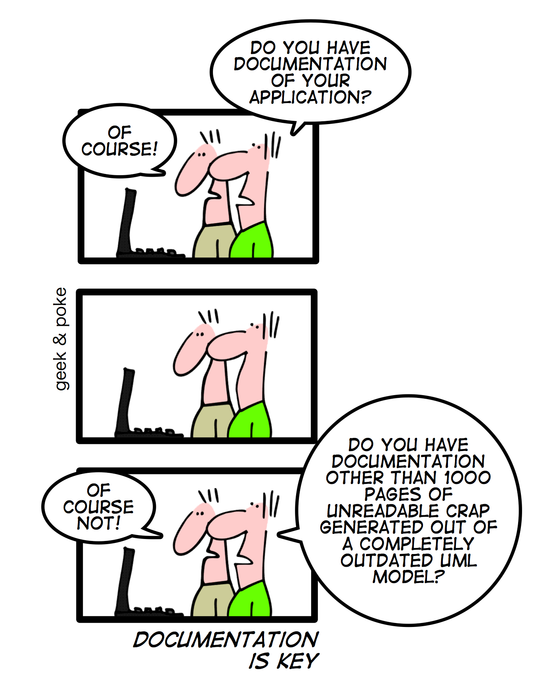

# Metodologia da Pesquisa Científica

Problema
---
   Documentação não é um dos processos mais glamurosos da programação, e geralmente é deixado de lado até o projeto ser finalizado. Além de normalmente ser feita através de ferramentas externas, facilitando que partes sejam omitidas, e alterações sem atualizar a documentação.
   [Documenting is designing: How documentation drives better design outcomes - Heidi Adkisson - Aug 5, 2020](https://uxdesign.cc/documenting-is-designing-how-documentation-drives-better-design-outcomes-3ebd87a33d57)

Motivação
---
   A documentação de um código age como um manual de instruções para o projeto, o problema é que devido a natureza do processo de desenvolvimento de software, diferente de um manual tradicional que é escrito e impresso uma vez (salvo algumas revisões) os processos mais importantes também são os processos atualizados com mais frequência, tornando sua documentação desatualizada.
   [How to write good documentation - Lari Maza - jan 30, 2020](https://medium.com/larimaza-en/how-to-write-good-documentation-e19c70dc67f0)
   
   No entanto, é uma das partes mais importantes do desenvolvimento. O tempo gasto documentando um projeto é resgatado em diversas ocasiões, como quando um novo integrante precisa se situar no projeto, ou quando um cliente tem sua dúvida respondida por uma rápida pesquisa.
   [Do developers dream of self-documenting code? - Andrea Chiarelli - Jan 16, 2017](https://medium.com/eloquent-coding/do-developers-dream-of-self-documenting-code-ca64d472197a)

   Os problemas apresentados não são novidade, e já existem diversas ferramentas que solucionam muitos deles. No entanto, os documentos produzidos são geralmente voltados a outros desenvolvedores. Deixando uma lacuna quando o objetivo da documentação for para fins acadêmicos.
   [Ten simple rules for documenting scientific software - Benjamin D. Lee - December 20, 2018](https://journals.plos.org/ploscompbiol/article?id=10.1371/journal.pcbi.1006561)

[Figura 1 - Charge sobre projeto mal documentado](http://geek-and-poke.com/geekandpoke/2010/1/31/documentation-is-key.html)

Proposta de Solução
---
  Será criado um pacote NPM que fornecerá decorators possibilitando documentar projetos "on-the-fly". Gerando um documento Latex baseado em blocos de comentários, que terão sua formatação definida pelo decorator utilizado para identificá-lo. Usa-ra a estrutura de diretórios do arquivo para organizar o documento final, dando ferramentas ao usuário para altera-la, caso preciso.
  
  Como a solução utiliza a estrutura de diretórios como base para organizar o documento final, ele acaba ficando mais intuitivo de se navegar. Tornando possível que refatorações do documento final, sejam replicadas automáticamente aos blocos de comentário originais.
  
  Em projetos grandes, é fácil de se perder na hora de documentar uma alteração. Isso deixa de ser um problema quando a documentação é escrita no próprio arquivo que foi alterado. Deixando todo processo de buscar o local onde as novas informações devem ser armazenadas dentro do documento para a aplicação.

  Tratar documentação como código nos ajuda a solucionar um problema grande de documentação por versão. Ao utilizar ferramentas de versionamento de software como git, é possível gerar documentos a partir de releases antigos, pois a documentação do código antigo está diretamente atrelada a ele. [Where should you put the documentation? - Nicolas Carlo - dev.to](https://dev.to/nicoespeon/where-should-you-put-the-documentation-18gg)
  
  Por ser um pacote NPM, sua integração com projetos já existentes não deve ser complicada. Possibilitando também, após a transição da documentação já existente para o novo formato, facilmente identificar trechos não cobertos automáticamente.

TO-DO
---
Estudar referencias:
   - https://journals.plos.org/ploscompbiol/article?id=10.1371/journal.pcbi.1006561

